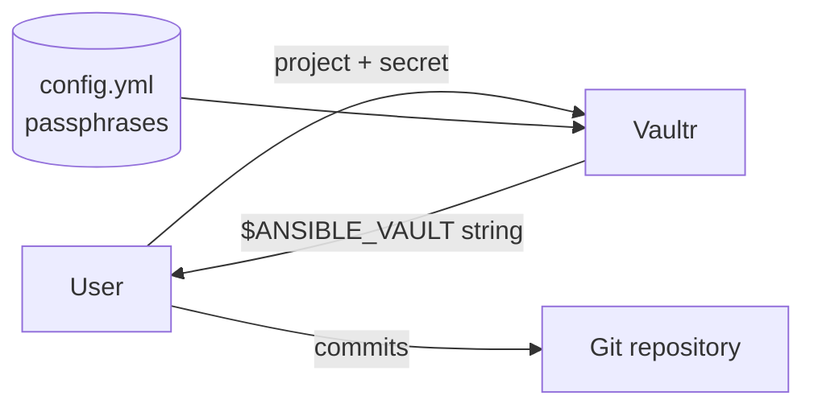

# Vaultr - Ansible Vault as a Service

Vaultr encrypts a secret into an
[Ansible Vault](https://docs.ansible.com/ansible/latest/vault_guide/) string on behalf
of a user who is not allowed to know the vault passphrase.

## The idea

Vault passphrases are held by a small group of people, but everybody needs to add
encrypted values to the inventory: a database password, an API token, a certificate
key. Sharing the passphrase to make that possible defeats the point of having one.

Vaultr closes that gap. Projects and their passphrases are configured on the server.
A user picks a project, pastes a secret, and receives the `$ANSIBLE_VAULT` string.

!!! note "Encryption only"
    There is deliberately no decryption endpoint. A user who can decrypt could read
    back every secret ever committed, which is exactly what this service prevents.

## Features

- **Web UI** — a small server rendered page, styled with
  [daisyUI](https://daisyui.com), enhanced with [htmx](https://htmx.org).
- **JSON API** — with an OpenAPI schema and interactive docs at `/docs`.
- **YAML snippets** — optionally returns the `key: !vault |` block that
  `ansible-vault encrypt_string --stdin-name` produces, ready to paste.
- **Vault IDs** — a project can carry an Ansible vault ID, emitting a labelled
  `1.2` header instead of the plain `1.1` one.
- **Flexible passphrase sources** — inline, from the environment, or from a mounted
  secret file.
- **Bearer token authentication** — optional, for the UI and the API alike.

## Next steps

- [Install](install.md) it locally or as a container.
- [Define your projects](configuration.md).
- [Call the API](api.md).
