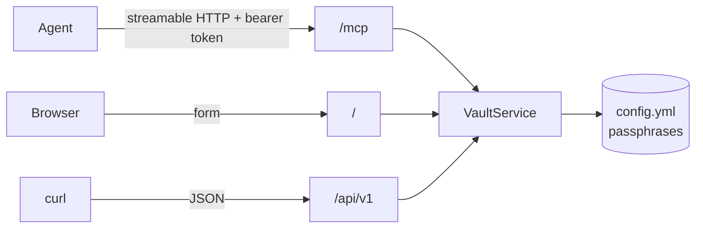

# MCP server

Vaultr speaks the [Model Context Protocol](https://modelcontextprotocol.io) at `/mcp`,
so an AI agent can encrypt a secret for a project without anyone handing it a vault
passphrase.

The MCP endpoint is part of the service itself, not a separate process. It is backed by
the same encryption code as the HTTP API and shares its
[bearer token](settings.md#authentication), so there is one deployment and one auth
model.



## Connecting

The transport is streamable HTTP. Point your client at `https://vaultr.example.com/mcp`
and send the token as an `Authorization` header.

=== "Claude Code"

    ```bash
    claude mcp add --transport http vaultr https://vaultr.example.com/mcp \
      --header "Authorization: Bearer $VAULTR_TOKEN"
    ```

=== "JSON config"

    ```json
    {
      "mcpServers": {
        "vaultr": {
          "type": "http",
          "url": "https://vaultr.example.com/mcp",
          "headers": {
            "Authorization": "Bearer ${VAULTR_TOKEN}"
          }
        }
      }
    }
    ```

Set `VAULTR_MCP_ENABLED=false` to turn the endpoint off entirely.

## Tools

### `list_vault_projects`

Returns the configured projects, exactly as the [API](api.md#list-projects) does.
Passphrases are never included. Marked read-only.

```json
{"projects": [{"name": "prod-myproject", "description": "Production", "vault_id": null}]}
```

### `encrypt_secret`

| Argument        | Required | Description                                             |
| --------------- | -------- | ------------------------------------------------------- |
| `project`       | yes      | Project name, as returned by `list_vault_projects`.      |
| `secret`        | yes      | The plaintext, encrypted verbatim.                       |
| `variable_name` | no       | Ansible variable name; adds a ready to paste YAML block. |

```json
{
  "project": "prod-myproject",
  "vault_id": null,
  "vault_text": "$ANSIBLE_VAULT;1.1;AES256\n6430...",
  "yaml_snippet": "db_password: !vault |\n          $ANSIBLE_VAULT;1.1;AES256\n          6430..."
}
```

The tool is annotated as non-destructive and **not idempotent**: encryption is salted,
so the same input produces a different vault string on every call. That is expected and
does not mean the previous call failed.

There is no decryption tool, for the same reason there is no decryption endpoint.

## Errors

Failures an agent can act on come back as tool errors carrying the reason, so the model
can correct itself rather than guess:

```
Error executing tool encrypt_secret: unknown project 'prod'.
Configured projects: prod-myproject, test-myproject
```

Empty secrets, oversized secrets and invalid Ansible variable names are reported the
same way. Anything unexpected is reported generically and the detail stays in the
server log.

## Security

Everything in [Security](security.md) applies here, plus one consideration specific to
agents.

!!! warning "An agent can be talked into calling a tool"
    A prompt injection in content the agent reads can make it encrypt attacker chosen
    text for a project it has access to. The output is a valid vault string that
    Ansible will decrypt and trust. Give an agent a token only for the projects and
    environments where that is acceptable, and review what a run committed as you would
    review a pull request.

The endpoint is refused without a valid token whenever `VAULTR_API_TOKENS` is set. With
no tokens configured it is open, exactly like the rest of the service, which is only
appropriate behind an authenticating proxy.
