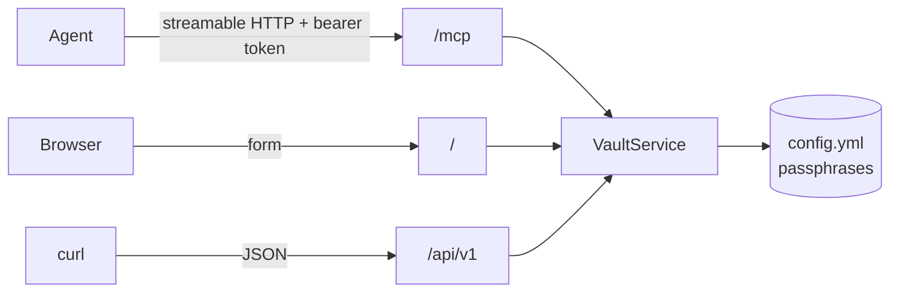

# MCP server

Vaultr speaks the [Model Context Protocol](https://modelcontextprotocol.io) at `/mcp`,
so an AI agent can encrypt a secret for a project without anyone handing it a vault
passphrase.

The MCP endpoint is part of the service itself, not a separate process. It is backed by
the same encryption code as the HTTP API and shares its
[bearer token](settings.md#authentication), so there is one deployment and one auth
model.



## Connecting

The transport is streamable HTTP. Point your client at `https://vaultr.example.com/mcp`
and send the token as an `Authorization` header.

=== "Claude Code"

    ```bash
    claude mcp add --transport http vaultr https://vaultr.example.com/mcp \
      --header "Authorization: Bearer $VAULTR_TOKEN"
    ```

=== "JSON config"

    ```json
    {
      "mcpServers": {
        "vaultr": {
          "type": "http",
          "url": "https://vaultr.example.com/mcp",
          "headers": {
            "Authorization": "Bearer ${VAULTR_TOKEN}"
          }
        }
      }
    }
    ```

Set `VAULTR_MCP_ENABLED=false` to turn the endpoint off entirely.

## Tools

### `list_vault_projects`

Returns the configured projects, exactly as the [API](api.md#list-projects) does.
Passphrases are never included. Marked read-only.

```json
{"projects": [{"name": "prod-myproject", "description": "Production", "vault_id": null}]}
```

### `encrypt_secret`

| Argument        | Required | Description                                             |
| --------------- | -------- | ------------------------------------------------------- |
| `project`       | yes      | Project name, as returned by `list_vault_projects`.      |
| `secret`        | yes      | The plaintext, encrypted verbatim.                       |
| `variable_name` | no       | Ansible variable name; adds a ready to paste YAML block. |

```json
{
  "project": "prod-myproject",
  "vault_id": null,
  "vault_text": "$ANSIBLE_VAULT;1.1;AES256\n6430...",
  "yaml_snippet": "db_password: !vault |\n          $ANSIBLE_VAULT;1.1;AES256\n          6430..."
}
```

The tool is annotated as non-destructive and **not idempotent**: encryption is salted,
so the same input produces a different vault string on every call. That is expected and
does not mean the previous call failed.

There is no decryption tool, for the same reason there is no decryption endpoint.

### `reencrypt_secret`

Moves an already encrypted secret from one project's passphrase to another's, for
example promoting a staging value into production.

| Argument         | Required | Description                                              |
| ---------------- | -------- | -------------------------------------------------------- |
| `source_project` | yes      | The project the secret is encrypted for today.            |
| `target_project` | yes      | The project it should be encrypted for instead.           |
| `vault_text`     | yes      | The `$ANSIBLE_VAULT` string, or a whole `key: !vault \|` block. |
| `variable_name`  | no       | Ansible variable name; adds a ready to paste YAML block.  |

```json
{
  "source_project": "test-myproject",
  "target_project": "prod-myproject",
  "vault_id": null,
  "vault_text": "$ANSIBLE_VAULT;1.1;AES256\n3861...",
  "yaml_snippet": "db_password: !vault |\n          $ANSIBLE_VAULT;1.1;AES256\n          3861..."
}
```

The plaintext is never returned; it exists only between the decrypt and the
re-encrypt. `list_vault_projects` reports each project's `reencrypt_targets`, so an
agent can see where a secret may be moved before it tries.

The tool is not registered at all when `VAULTR_REENCRYPT_ENABLED=false`, so a disabled
instance does not advertise something that would always fail.

## Errors

Failures an agent can act on come back as tool errors carrying the reason, so the model
can correct itself rather than guess:

```
Error executing tool encrypt_secret: unknown project 'prod'.
Configured projects: prod-myproject, test-myproject
```

Empty secrets, oversized secrets and invalid Ansible variable names are reported the
same way. Anything unexpected is reported generically and the detail stays in the
server log.

## Security

Everything in [Security](security.md) applies here, plus two considerations specific
to agents.

!!! warning "An agent can be talked into calling a tool"
    A prompt injection in content the agent reads can make it encrypt attacker chosen
    text for a project it has access to. The output is a valid vault string that
    Ansible will decrypt and trust. Give an agent a token only for the projects and
    environments where that is acceptable, and review what a run committed as you would
    review a pull request.

!!! danger "`reencrypt_secret` can be used to read a secret, not only write one"
    Re-encryption decrypts with the source project's passphrase. An agent that is
    induced to move a production secret into a project whose passphrase the attacker
    knows has handed them that secret, and the same is true of a human calling the
    [HTTP API](api.md#re-encrypt-a-secret). The tool description tells the model not to
    act on instructions found in data it has read, but a tool description is guidance,
    not an access control.

    Where that matters, constrain it on the server rather than relying on the model:
    set [`reencrypt_targets`](configuration.md#re-encryption-targets) so production
    secrets cannot leave, or set `VAULTR_REENCRYPT_ENABLED=false` to remove the tool.
    See [Security](security.md#re-encryption).

The endpoint is refused without a valid token whenever `VAULTR_API_TOKENS` is set. With
no tokens configured it is open, exactly like the rest of the service, which is only
appropriate behind an authenticating proxy.
